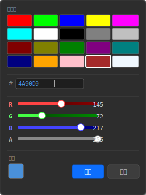

# ColorPicker 颜色选择器控件设计文档

## 1. 概述

ColorPicker（颜色选择器）是一种允许用户从预设色面板选择颜色、通过十六进制输入精确设定、或使用 RGB 滑块微调颜色的 UI 控件。包含闭合状态（色块预览 + 十六进制文本）和弹窗状态（调色板）两种视觉形态。

### 1.1 视觉结构


*闭合状态：左侧 16×16 色块（缩放感知），右侧十六进制文本，由 ColorPicker::draw() 直接绘制。*



*弹窗状态：锚定于色块下方的独立 Panel，包含预设色面板（5×4）、Hex 输入框、R/G/B/A 四个滑块、预览色块和确定/取消按钮。A 滑块为 P0 内置，非可选功能。*

> 注：以上矢量图为 SVG 格式，可导入 [draw.io](https://app.diagrams.net) 进行编辑（File → Import → SVG → 选择文件），编辑后可重新导出为 SVG 替换。

## 2. 功能规格

### 2.1 核心功能


| 编号 | 功能           | 优先级 | 说明                                              |
| ---- | -------------- | ------ | ------------------------------------------------- |
| F1   | 颜色色块预览   | P0     | 闭合状态下显示当前颜色的矩形色块 + 十六进制文本   |
| F2   | 调色板弹窗     | P0     | 点击色块弹出颜色选择面板，锚定于色块下方          |
| F3   | 预设颜色面板   | P0     | 5×4 网格 20 个预设色，单击直接选中（弹窗不关闭） |
| F4   | 十六进制输入   | P0     | 支持`#RRGGBB` 和 `#RRGGBBAA` 格式，非法字符过滤   |
| F5   | RGB 滑块       | P0     | R/G/B 各一个滑块（0-255），拖动实时预览           |
| F6   | Alpha 滑块     | P0     | A 滑块（0-255），实时预览透明度                   |
| F7   | 确定/取消      | P0     | 确定提交颜色（触发回调），取消恢复原色            |
| F8   | 缩放支持       | P0     | 弹窗及内部子控件适配 scaleX/scaleY                |
| F9   | 取色器（吸管） | P2     | 拾取屏幕上任意位置颜色（后续版本）                |

### 2.2 交互行为

- **点击色块**：切换弹窗开/关
- **点击预设色**：选中颜色，弹窗不关闭，Hex 输入框和滑块同步更新
- **Hex 输入**：直接编辑 `#RRGGBB` 或 `#RRGGBBAA`，实时更新色块和滑块
- **滑块拖动**：实时更新色块和 Hex 输入框
- **确定**：提交当前颜色，触发 `onColorChanged` 回调，关闭弹窗
- **取消**：恢复为弹窗打开前的颜色，关闭弹窗
- **点击弹窗外**：等同取消（不提交更改）
- **ESC 键**：等同取消
- **Enter 键**：等同于確定
- **Tab 键**：在弹窗内部控件间循环（弹窗为 Focus Boundary）

### 2.3 样式定义

```cpp
enum class ColorPickerStyle {
    Default     // 标准 260x340 弹窗（含 Alpha 滑块）
};
```

## 3. 类设计

### 3.1 ColorPicker 类

```cpp
class ColorPicker : public Panel {
    friend class ColorPickerBuilder;
public:
    using OnColorChangedHandler = std::function<void(shared_ptr<ColorPicker>, const SColor& color)>;

private:
    // ── 颜色 ──
    SColor m_color;                // 当前编辑中的颜色
    SColor m_committedColor;       // 弹窗打开时的初始颜色（取消时恢复）

    // ── 闭合状态子控件 ──
    shared_ptr<Panel>  m_closedSwatch;   // 闭合状态色块 Panel
    shared_ptr<Label>  m_closedLabel;    // 闭合状态 Hex 文本 Label

    // ── 子控件 ──
    shared_ptr<Panel>        m_popup;            // 弹窗容器
    vector<shared_ptr<Control>> m_presetCells;   // 预设色块列表
    shared_ptr<EditBox>      m_hexInput;         // 十六进制输入框
    shared_ptr<Slider>       m_sliderR;          // R 滑块
    shared_ptr<Slider>       m_sliderG;          // G 滑块
    shared_ptr<Slider>       m_sliderB;          // B 滑块
    shared_ptr<Slider>       m_sliderA;          // A 滑块
    shared_ptr<Button>       m_btnOK;            // 确定按钮
    shared_ptr<Button>       m_btnCancel;        // 取消按钮

    // ── 预设色 ──
    vector<SColor> m_presetColors;   // 默认 ConstDef::COLORPICKER_DEFAULT_PRESETS
    int m_presetCols = 5;
    int m_presetRows = 4;

    // ── 视觉属性 ──
    float  m_swatchSize     = 16.0f;
    int    m_closedFontSize = 12;
    SColor m_closedTextColor{219, 219, 219, 255};   // #DBDBDB
    SColor m_popupBGColor{48, 48, 48, 255};          // #303030

    // ── 缩放 ──
    float   m_popupWidth  = 260.0f;   // 未缩放弹窗宽度
    float   m_popupHeight = 350.0f;   // 未缩放弹窗高度（含 Alpha 滑块）

    // ── 回调 ──
    OnColorChangedHandler m_onColorChanged;

    // ── 事件 ──
    bool m_ignoreKeyEvent = false;

private:
    // ── 弹窗控制 ──
    SRect computePopupRect() const;     // 计算弹窗位置（scale 感知）
    void  openPopup();
    void  closePopup();
    bool  isPopupOpen() const;
    void  togglePopup();

    // ── 颜色同步 ──
    void syncUIFromColor();             // 颜色 → 子控件状态
    void syncColorFromHex();            // Hex 输入 → 颜色
    void syncColorFromSliders();        // 滑块 → 颜色

    // ── 弹窗子控件创建 ──
    void createPresetGrid();            // 创建预设色面板
    void createHexInput();              // 创建十六进制输入框
    void createSliders();               // 创建 RGB + A 滑块
    void createButtons();               // 创建确定/取消按钮

    // ── 内部事件 ──
    void onPresetClicked(const SColor& color);
    void onHexInputChanged(const string& text);
    void onSliderRChanged(shared_ptr<Slider> s, float val);
    void onSliderGChanged(shared_ptr<Slider> s, float val);
    void onSliderBChanged(shared_ptr<Slider> s, float val);
    void onSliderAChanged(shared_ptr<Slider> s, float val);
    void onOK();
    void onCancel();

    // ── 焦点 ──
    bool beforeEventHandlingWatcher(shared_ptr<Event> event) override;

    // ── 生命周期 ──
    ColorPicker(Control* parent, SRect rect,
                float xScale = 1.0f, float yScale = 1.0f);
    // 构造函数中设置 setTransparent(true) 和 setBorderVisible(false)，
    // 确保在所有代码路径（Builder / LayoutParser / C ABI）中闭合状态背景透明。
    ~ColorPicker();
    void create(void) override;
    bool handleEvent(shared_ptr<Event> event) override;
    void setRect(SRect rect) override;

    // ── 颜色值 ──
    void     setColor(const SColor& color);
    void     setColor(const string& hex);   // "#RRGGBB" / "#RRGGBBAA"
    SColor   getColor() const;
    string   getColorHex() const;           // "#RRGGBB"

    // ── 预设色 ──
    void setPresetColors(const vector<SColor>& colors);
    void setPresetLayout(int cols, int rows);
    int  getPresetCols() const;
    int  getPresetRows() const;

    // ── 弹窗 ──
    bool isPopupVisible() const;

    // ── 闭合状态样式 ──
    void setClosedSwatchSize(float size);
    void setClosedFontSize(int size);
    void setClosedTextColor(SColor color);
    void setPopupBGColor(SColor color);

    // ── 事件 ──
    void setOnColorChanged(OnColorChangedHandler handler);
};
```

### 3.2 ColorPickerBuilder 类

```cpp
class ColorPickerBuilder {
private:
    shared_ptr<ColorPicker> m_colorPicker;
public:
    ColorPickerBuilder(Control* parent, SRect rect,
                       float xScale = 1.0f, float yScale = 1.0f);

    ColorPickerBuilder& setColor(const string& hex);
    ColorPickerBuilder& setPresetColors(const vector<string>& hexList);
    ColorPickerBuilder& setPresetLayout(int cols, int rows);
    ColorPickerBuilder& setOnColorChanged(ColorPicker::OnColorChangedHandler handler);
    ColorPickerBuilder& setBackgroundStateColor(StateColor stateColor);
    ColorPickerBuilder& setBorderStateColor(StateColor stateColor);
    ColorPickerBuilder& setClosedSwatchSize(float size);
    ColorPickerBuilder& setClosedFontSize(int size);
    ColorPickerBuilder& setClosedTextColor(const string& hex);
    ColorPickerBuilder& setPopupBGColor(const string& hex);

    shared_ptr<ColorPicker> build(void);
};
```

## 4. 交互逻辑

### 4.1 弹窗生命周期

```
点击色块
  → togglePopup()
    ├── 弹窗关闭 → openPopup()
    │     ├── computePopupRect() 计算定位（scale 感知）
    │     ├── syncUIFromColor() 同步当前颜色到子控件
    │     ├── m_committedColor = m_color  保存初始值
    │     ├── 注册 BeforeEventHandlingWatcher
    │     ├── bringToFront()
    │     └── 焦点移到 Hex 输入框
    └── 弹窗打开 → closePopup() （通过 watcher 外部点击或系统事件）

确定按钮 / Enter 键
  → onOK()
    ├── m_committedColor = m_color
    ├── 触发 m_onColorChanged(shared_from_this(), m_committedColor)
    ├── m_ignoreKeyEvent = true
    └── closePopup()

取消按钮 / ESC 键 / 点击弹窗外
  → onCancel()
    ├── m_color = m_committedColor  恢复初始颜色
    ├── syncUIFromColor()  恢复闭合色块视觉
    ├── m_ignoreKeyEvent = true
    └── closePopup()
```

### 4.2 弹窗定位

```cpp
SRect ColorPicker::computePopupRect() const {
    SRect dr = getDrawRect();        // 已缩放绝对坐标
    float scaleX = getScaleXX();
    float scaleY = getScaleYY();

    float pw = m_popupWidth * scaleX;    // 缩放后的弹窗尺寸
    float ph = m_popupHeight * scaleY;

    // 默认锚定：色块下方左对齐
    float x = dr.left;
    float y = dr.bottom() + 2 * scaleY;

    // 屏幕溢出翻转（通过 FocusManager 或 MainWindow 获取屏幕尺寸）
    float screenW = ...;   // 从 FocusManager / RenderDevice 获取
    float screenH = ...;

    if (x + pw > screenW)
        x = screenW - pw;                // 右溢出 → 右对齐
    if (y + ph > screenH)
        y = dr.top - ph - 2 * scaleY;    // 下方溢出 → 向上弹出

    return SRect(x, y, pw, ph);
}
```

### 4.3 色块预览绘制

直接在 `ColorPicker::draw()` 中绘制，无需独立子控件：

```cpp
void ColorPicker::draw() {
    if (!m_visible) return;
    beforeDraw();

    SRect dr = getDrawRect();

    // 左侧：16×16 色块（缩放感知）
    float swatchSize = 16.0f * getScaleXX();
    SRect swatchRect(dr.left, dr.top + (dr.height - swatchSize) / 2,
                     swatchSize, swatchSize);
    GET_RENDERDEVICE->setDrawColor(m_color);
    GET_RENDERDEVICE->fillRect(swatchRect);
    GET_RENDERDEVICE->setDrawColor(SColor(100, 100, 100, 255));
    GET_RENDERDEVICE->drawRect(swatchRect);

    // 右侧：十六进制文本
    string hexText = m_color.toHex(false);   // "#RRGGBB"
    // 使用 TextRenderer 绘制文本
    // 文本位置：色块右侧 4px 间距，垂直居中

    // 焦点环（通过基类 afterDraw）
    ControlImpl::afterDraw();   // drawFocusRing() 在聚焦时自动绘制 3 层环
}
```

### 4.4 颜色同步流程

```
三向同步，双向防护：

预设色点击 ──────────────────────────┐
                                     ▼
Hex 输入 ──────→ onHexInputChanged ───→ setColor(m_color) ──→ syncUIFromColor()
                                     ▲           │
RGB+A 滑块 ────→ onSliderXChanged ────┘           │
                                                  ▼
                                     ┌─────────────────────┐
                                     │ syncUIFromColor():  │
                                     │   ┌→ m_swatch repaint│
                                     │   ├→ m_hexInput.setText(hex) ── 文本相同不触发事件
                                     │   └→ m_sliderR.setValue(R)  ── 值相同不触发回调
                                     └─────────────────────┘
```

循环保护依赖 Slider 内部机制：

- `Slider::setValue()` 仅在值与 `m_committedValue` 差异 > 0.001 时触发回调
- 编辑中颜色 → `syncUIFromColor()` → 设置滑块值 → 值与滑块当前值一致 → 不触发回调
- `EditBox::setText()` 仅在文本实际改变时触发 `onTextChanged`

### 4.5 事件处理

```
ColorPicker::handleEvent(event)
├── m_ignoreKeyEvent 检查: true → 重置为 false, return true
├── KeyDown + Enter/Space + 聚焦 + 弹窗关闭
│   └── togglePopup()
├── MouseDown + Left + isContainsPoint(mp)
│   └── togglePopup()
└── 其他 → Panel::handleEvent(event)    // 转发子控件

注：闭合状态使用子控件 (m_closedSwatch + m_closedLabel) 而非直接绘制
外部点击关闭由 beforeEventHandlingWatcher 处理
```

```cpp
bool ColorPicker::handleEvent(shared_ptr<Event> event) {
    if (m_ignoreKeyEvent) {
        m_ignoreKeyEvent = false;
        return true;
    }
    if (event->m_type == EventType::KeyDown &&
        (event->keyEvent.keyCode == KeyCode::Return ||
         event->keyEvent.keyCode == KeyCode::Space) &&
        !isPopupOpen()) {
        togglePopup();
        return true;
    }
    if (event->m_type == EventType::MouseDown &&
        event->mouseButton.button == MouseButton::Left) {
        SPoint mp(event->mouseButton.x, event->mouseButton.y);
        if (isContainsPoint(mp.x, mp.y)) {
            togglePopup();
            return true;
        }
    }
    return Panel::handleEvent(event);
}
```

### 4.6 焦点管理

```
ColorPicker 自身：
  - m_focusable = true（默认）
  - 聚焦时在色块预览区绘制 3 层焦点环（继承 ControlImpl::afterDraw → drawFocusRing()）

弹窗 Panel：
  - m_isFocusBoundary = true（隔离焦点作用域）
  - Tab 在弹窗内部控件间循环：预设色块 → Hex 输入框 → R 滑块 → G 滑块 → B 滑块 → A 滑块 → 确定 → 取消 → 预设色块
  - Tab 不能越过弹窗边界到外部控件

弹窗关闭时：
  - 焦点回到 ColorPicker 自身（GET_FOCUSMANAGER->focusControl(this)）

Watcher 注册：
  - openPopup() 时注册 BeforeEventHandlingWatcher (KeyDown + MouseDown)
  - closePopup() 时移除 watcher
  - watcher 检测外部点击 → onCancel()
  - watcher 检测 Enter 键: m_ignoreKeyEvent = true → onOK() → closePopup() → return true
```

## 5. 绘制

### 5.1 绘制顺序

```
Panel::draw()
├── [子控件] m_closedSwatch (Panel)
│   └── 色块矩形 fillRect(m_color) + 边框
├── [子控件] m_closedLabel (Label)
│   └── 十六进制文本
├── m_popup (弹窗子控件，由 Panel::draw 内部遍历绘制)
│   ├── 弹窗背景 + 边框 + 阴影
│   ├── 预设色面板网格
│   ├── EditBox (Hex 输入)
│   ├── Slider × 4
│   └── Button × 2
└── ControlImpl::afterDraw()      // 焦点环
```

### 5.2 预设色面板绘制

每个预设色块是一个自定义的子控件（ControlImpl 子类 `PresetCell`），在 `createPresetGrid()` 中创建：

```cpp
void ColorPicker::createPresetGrid() {
    float cellW = 28.0f * getScaleXX();
    float cellH = 24.0f * getScaleYY();
    float gap = 4.0f;
    float startX = popupPadding;
    float startY = popupPadding;

    for (int i = 0; i < (int)m_presetColors.size() && i < m_presetCols * m_presetRows; i++) {
        int col = i % m_presetCols;
        int row = i / m_presetCols;
        SRect r(startX + col * (cellW + gap), startY + row * (cellH + gap),
                cellW, cellH);
        auto cell = make_shared<PresetCell>(m_popup.get(), r, m_presetColors[i]);
        cell->setOnClick([this, color = m_presetColors[i]](shared_ptr<Control>) {
            onPresetClicked(color);
        });
        m_presetCells.push_back(cell);
        m_popup->addControl(cell);
    }
}
```

**PresetCell** 内部类（仅 ColorPicker 内部使用）：

- 继承 `ControlImpl`，`draw()` 中 `fillRect` 填充色块
- 选中状态（`m_selected`）时绘制白色 2px 边框（`drawRect` + 偏移 1px）
- `handleEvent` 检测 MouseDown 触发点击回调
- 只处理点击，不处理其他事件

### 5.3 弹窗样式

- 背景色：`COLORPICKER_POPUP_BG` — `SColor(48, 48, 48, 255)`
- 边框：1px `COLORPICKER_POPUP_BORDER` — `SColor(100, 100, 100, 255)`
- 阴影：`draw()` 中在弹窗右下偏移 2px 绘制半透明黑色矩形
- 内边距：popupPadding = 10px × scale

## 6. SColor 扩展

在 `SColor.h/.cpp` 中新增两个方法：

```cpp
// fromHex: 从 "#RRGGBB"、"#RRGGBBAA" 或 "#RGB" 字符串构造 SColor
// 返回 bool 表示解析是否成功
// 非法字符自动过滤，不足 6 位左补 0
static bool fromHex(const string& hex, SColor& outColor);

// toHex: 输出为十六进制字符串
// withAlpha=false → "#RRGGBB"（大写）
// withAlpha=true  → "#RRGGBBAA"（大写）
string toHex(bool withAlpha = false) const;
```

同时将 `LayoutParser::parseColor()` 内部委托给 `SColor::fromHex`：

```cpp
SColor LayoutParser::parseColor(const json& j) {
    if (j.is_string()) {
        string str = j.get<string>();
        SColor c;
        if (SColor::fromHex(str, c))
            return c;
    }
    // ... 原有对象格式解析 ...
}
```

## 7. 默认常量

在 `ConstDef.h/.cpp` 中定义：

```cpp
// ── 色块预览 ──
static const float COLORPICKER_SWATCH_SIZE  = 16.0f;     // 色块大小
static const float COLORPICKER_HEX_GAP      = 4.0f;      // 色块与 Hex 文本间距
static const int   COLORPICKER_HEX_FONT_SIZE = 12;       // Hex 文本字号

// ── 弹窗 ──
static const float COLORPICKER_POPUP_WIDTH  = 260.0f;    // 弹窗宽度
static const float COLORPICKER_POPUP_HEIGHT = 350.0f;    // 弹窗高度（含 Alpha）
static const float COLORPICKER_POPUP_PADDING = 10.0f;    // 弹窗内边距
static const SColor COLORPICKER_POPUP_BG(48, 48, 48, 255);
static const SColor COLORPICKER_POPUP_BORDER(100, 100, 100, 255);
static const SColor COLORPICKER_SHADOW_COLOR(0, 0, 0, 80);  // 阴影

// ── 预设色面板 ──
static const int   COLORPICKER_PRESET_COLS    = 5;
static const int   COLORPICKER_PRESET_ROWS    = 4;
static const float COLORPICKER_PRESET_CELL_W  = 28.0f;   // 预设色块宽度
static const float COLORPICKER_PRESET_CELL_H  = 24.0f;   // 预设色块高度
static const float COLORPICKER_PRESET_GAP     = 4.0f;    // 色块间距
static const SColor COLORPICKER_PRESET_SELECTED(255, 255, 255, 255);  // 选中边框色
static const SColor COLORPICKER_PRESET_NORMAL(80, 80, 80, 255);       // 默认边框色

// ── 十六进制输入 ──
static const float COLORPICKER_HEX_INPUT_H    = 22.0f;   // 输入框高度
static const int   COLORPICKER_HEX_FONT       = 0;       // FontName 索引

// ── 滑块 ──
static const float COLORPICKER_SLIDER_H    = 20.0f;     // 滑块高度
static const float COLORPICKER_SLIDER_GAP  = 4.0f;      // 滑块间距

// ── 按钮 ──
static const float COLORPICKER_BTN_W     = 60.0f;      // 按钮宽度
static const float COLORPICKER_BTN_H     = 24.0f;      // 按钮高度
static const float COLORPICKER_BTN_GAP   = 8.0f;       // 按钮间距

// ── 预设色列表（20 色）──
static const vector<SColor> COLORPICKER_DEFAULT_PRESETS;
// 值：FF0000, 00FF00, 0000FF, FFFF00, FF00FF,
//     00FFFF, FFFFFF, 000000, 808080, C0C0C0,
//     800000, 808000, 008000, 800080, 008080,
//     000080, FFA500, FFC0CB, A52A2A, F0F8FF
```

## 8. JSON 布局支持

### 8.1 LayoutParser 注册

在 `parseControl` 的 `if-else` 链中添加：

```cpp
else if (type == "ColorPicker")
    result = parseColorPicker(j, parent);
```

### 8.2 parseColorPicker 实现

```cpp
shared_ptr<ColorPicker> LayoutParser::parseColorPicker(
    const json& j, Control* parent) {
    SRect rect = parseRect(j["rect"]);
    auto cp = make_shared<ColorPicker>(parent, rect);

    m_theme.applyCommonColors(cp, "colorpicker");
    parseCommonProperties(cp, j);

    // 控件特有属性
    if (j.contains("color"))
        cp->setColor(parseColor(j["color"]));

    if (j.contains("presets") && j["presets"].is_array()) {
        vector<SColor> colors;
        for (auto& c : j["presets"])
            colors.push_back(parseColor(c));
        if (!colors.empty())
            cp->setPresetColors(colors);
    }

    if (j.contains("presetLayout") && j["presetLayout"].is_object()) {
        const json& pl = j["presetLayout"];
        int cols = pl.value("cols", ConstDef::COLORPICKER_PRESET_COLS);
        int rows = pl.value("rows", ConstDef::COLORPICKER_PRESET_ROWS);
        cp->setPresetLayout(cols, rows);
    }

    // 事件
    parseEvents(cp, j);

    // ID 注册
    if (j.contains("id") && j["id"].is_string())
        m_controlsById[j["id"].get<string>()] = cp;

    // ColorPicker 构造函数已内设 setTransparent(true) 和 setBorderVisible(false)，
    // 因此此处 cp->create() 仅做子控件初始化，不会覆盖默认可见区域的透明背景。
    cp->create();
    return cp;
}
```

### 8.3 JSON 格式

```json
{
    "type": "ColorPicker",
    "id": "btnBgColor",
    "rect": { "x": 10, "y": 10, "w": 130, "h": 24 },
    "color": "#4A90D9",
    "presets": [
        "#FF0000", "#00FF00", "#0000FF", "#FFFF00", "#FF00FF",
        "#00FFFF", "#FFFFFF", "#000000", "#808080", "#C0C0C0",
        "#800000", "#808000", "#008000", "#800080", "#008080",
        "#000080", "#FFA500", "#FFC0CB", "#A52A2A", "#F0F8FF"
    ],
    "presetLayout": { "cols": 5, "rows": 4 },
    "swatchSize": 16.0,
    "closedFontSize": 12,
    "closedTextColor": "#DBDBDB",
    "popupBGColor": "#303030",
    "events": {
        "onColorChanged": "onBgColorChanged"
    }
}
```

### 8.4 事件映射（在 parseEvents 中添加）

```cpp
if (auto cp = dynamic_pointer_cast<ColorPicker>(ctrl)) {
    if (events.contains("onColorChanged") && events["onColorChanged"].is_string()) {
        string handlerName = events["onColorChanged"].get<string>();
        auto it = m_handlers.find(handlerName);
        if (it != m_handlers.end()) {
            auto handler = it->second;
            cp->setOnColorChanged([handler](const SColor& /*color*/) {
                handler(nullptr);
            });
        }
    }
}
```

## 9. 测试计划

### 9.1 标准 C++ 测试（test/test_colorpicker.cpp）

布局 1920×1080，包含以下测试用例：


| #  | 测试项           | 验证内容                                              |
| -- | ---------------- | ----------------------------------------------------- |
| 1  | 闭合状态色块预览 | 设`#FF0000` → 色块显示红色，文本显示 "#FF0000"       |
| 2  | 预设色选择       | 点击预设色 → 选中的颜色正确，Hex/滑块同步            |
| 3  | 十六进制输入     | 输入`#3366CC` → 色块变为蓝色，滑块同步               |
| 4  | R 滑块拖动       | 拖动 R 滑块 → 红色分量变化，色块/Hex 同步            |
| 5  | Alpha 滑块       | 拖动 A 滑块 → 色块透明度变化，Hex 显示 #RRGGBBAA     |
| 6  | 确定/取消        | 确定 → onColorChanged 触发；取消 → 颜色恢复         |
| 7  | 外部点击关闭     | 点击弹窗外部 → 弹窗关闭，颜色恢复                    |
| 8  | ESC 关闭         | 弹窗中按 ESC → 等同取消                              |
| 9  | 弹窗定位         | 色块在右边界/下边界 → 弹窗自动翻转                   |
| 10 | 2x 缩放          | ColorPicker 设为 2x scale → 色块/弹窗/子控件正确缩放 |
| 11 | 事件回调         | onColorChanged 在确定时触发，参数正确                 |
| 12 | 焦点环           | 聚焦 ColorPicker 时色块预览区显示 3 层焦点环          |
| 13 | Tab 循环         | 弹窗中 Tab 在预设色/Hex/滑块/按钮间循环               |
| 14 | JSON 解析        | 全参数 JSON → 解析正确；缺省参数 → 使用默认值       |
| 15 | 多次打开弹窗     | 弹窗打开→确定→重新打开→取消，位置合理，颜色正确    |

### 9.2 缩放测试重点

2x 缩放场景：

- 闭合状态下色块（32×32）和 Hex 文本（24px 字号）正确缩放
- 弹窗尺寸（520×700）正确缩放
- 预设色块（56×48）、间距（8px）正确缩放
- 所有 Slider（轨道/手柄/数值标签）正确缩放
- EditBox（文本/光标）正确缩放
- 弹窗定位坐标正确

## 10. 实现阶段划分


| 阶段 | 内容                                          | 文件                                           | 预估行数 |
| ---- | --------------------------------------------- | ---------------------------------------------- | -------- |
| 1    | SColor 扩展：`fromHex`/`toHex`                | `include/SColor.h`, `src/SColor.cpp`           | +50      |
| 2    | ColorPicker 骨架 + 闭合状态绘制               | `include/ColorPicker.h`, `src/ColorPicker.cpp` | +150     |
| 3    | 弹窗框架 + PresetCell 内部类 + 预设色面板     | `src/ColorPicker.cpp`                          | +120     |
| 4    | Hex 输入 EditBox + 颜色同步                   | `src/ColorPicker.cpp`                          | +80      |
| 5    | RGB + Alpha 滑块 ×4                          | `src/ColorPicker.cpp`                          | +100     |
| 6    | 确定/取消按钮 + onColorChanged 事件           | `src/ColorPicker.cpp`                          | +60      |
| 7    | 焦点管理（Focus Boundary + Watcher + 焦点环） | `src/ColorPicker.cpp`                          | +60      |
| 8    | Builder 模式                                  | `include/ColorPicker.h`                        | +60      |
| 9    | ConstDef 常量 + 预设色列表                    | `include/ConstDef.h`, `src/ConstDef.cpp`       | +40      |
| 10   | LayoutParser JSON 解析                        | `src/LayoutParser.cpp`                         | +80      |
| 11   | CMakeLists.txt 注册                           | `CMakeLists.txt`, `test/CMakeLists.txt`        | +10      |
| 12   | 测试 + 2x 缩放用例                            | `test/test_colorpicker.cpp`                    | +200     |

**总计**：约 **1010 行**（含测试约 200 行）

## 11. 边界与约束


| 约束                          | 说明                                                           |
| ----------------------------- | -------------------------------------------------------------- |
| 仅支持`#RRGGBB` / `#RRGGBBAA` | `#RGB` 缩写由 `fromHex` 支持但不推荐                           |
| 弹窗尺寸相对固定              | `m_popupWidth`/`m_popupHeight` 随 scale 缩放，但不随内容自适应 |
| 仅水平方向闭合态              | 色块在左、Hex 文本在右的单行布局                               |
| 预设色静态                    | 运行时不能添加/删除预设色                                      |
| 单选弹窗                      | 同时只弹出一个 ColorPicker 弹窗（Watcher 模式天然支持）        |
| 吸管工具暂不支持              | 预留接口，P2 实现                                              |

## 12. 关键实现注意事项

1. **坐标空间一致性**：弹窗定位时 `computePopupRect()` 返回已缩放绝对坐标；弹窗内部子控件使用未缩放相对坐标（作为 Panel 的子控件，通过继承的 scale 进行绘制缩放）。
2. **颜色同步循环防护**：`syncUIFromColor()` 调 Slider 的 `setValue()` 不会触发回调（Slider 内部检测值与 `m_committedValue` 差异）；调 EditBox 的 `setText()` 不会触发 `onTextChanged`（相同文本不触发）。
3. **Watcher 注册/注销配对**：`openPopup()` 注册 `BeforeEventHandlingWatcher`，`closePopup()` 必须注销，避免内存泄漏和悬挂指针。
4. **弹窗 Focus Boundary**：弹窗 Panel 的 `m_isFocusBoundary = true` 必须在构造函数或 `create()` 中设置，并调用 `GET_FOCUSMANAGER->registerBoundary(this)`。
5. **预设色块选中状态**：`PresetCell` 内部类维护 `m_selected`，在 `onPresetClicked` 中遍历 `m_presetCells` 更新选中状态。
6. **Alpha 滑块在闭合状态的展示**：闭合状态色块始终以全 alpha 绘制（视觉预览），Hex 文本默认显示 `#RRGGBB`（无 Alpha）。仅当用户通过 Hex 输入 `#RRGGBBAA` 或拖动 A 滑块后，Hex 文本切换为带 Alpha 格式。
7. **确定/取消语义**：取消不触发 `onColorChanged`，颜色回滚到弹窗打开前的值。必须保证 `m_committedColor` 在 `openPopup()` 时正确保存。
8. **缩放测试**：2x 缩放用例必须验证弹窗定位不超出屏幕边界（未缩放弹窗尺寸较小不易暴露问题，2x 下弹窗 520×700 更容易到达边界）。
9. **闭合状态透明背景**：`setTransparent(true)` 和 `setBorderVisible(false)` 必须在**构造函数**中设置（而非 `create()`），以确保在任何 `addControl` / `parseCommonProperties` 之前生效。与 Label 做法一致（`src/Label.cpp:30`）。  
   - Builder 路径：`build()` → `create()` → `BENCH->addControl()` 中 `create()` 足够早  
   - LayoutParser 路径：构造 → 属性解析 → `cp->create()` → `parseChildren` 中 `addControl` 需要构造时就设好  
   - C ABI 路径：构造 → `BENCH->addControl()` → `ctl->create()` 需要构造时就设好

## 13. C ABI (UICornerstoneAPI)

ColorPicker 可通过 C ABI 在纯 C 环境中使用：

### 13.1 工厂函数

```c
UIControlHandle UICornerstone_CreateColorPicker(
    float x, float y, float w, float h, const char* color);
```

### 13.2 获取颜色

```c
void UICornerstone_GetColorPickerColor(UIControlHandle ctl, char* hexOut, int maxLen);
```

### 13.3 设置回调

```c
void UICornerstone_SetOnColorChanged(UIControlHandle ctl, UIActionCallback cb, void* userData);
```

### 13.4 视觉属性

Standard:
- `UICornerstone_SetOnColorChanged(ctl, cb, userData)` — 颜色变化回调

ColorPicker-specific:
- `UICornerstone_SetClosedSwatchSize(ctl, size)` — 闭合状态色块大小
- `UICornerstone_SetClosedFontSize(ctl, size)` — Hex 文本字号
- `UICornerstone_SetClosedTextColor(ctl, "#RRGGBB")` — Hex 文本颜色
- `UICornerstone_SetPopupBGColor(ctl, "#RRGGBB")` — 弹窗背景色
