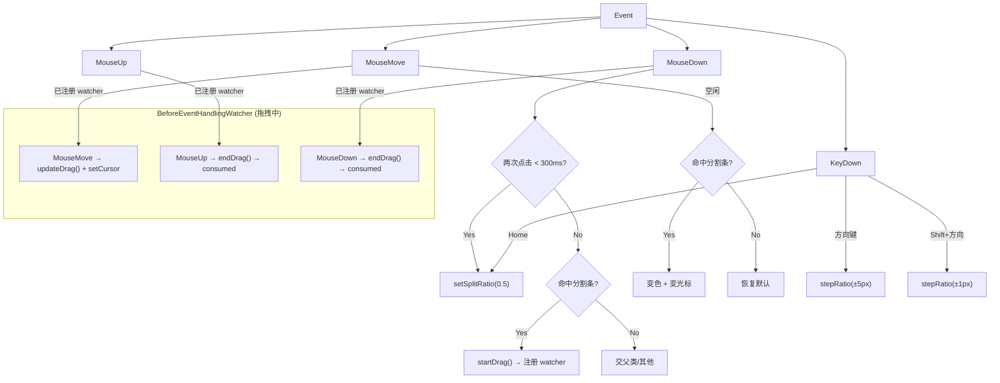

# Splitter 分割条控件设计文档

## 1. 概述

Splitter（分割条）是一种允许用户通过**拖拽分割条**来调整两侧 sibling 控件尺寸的 UI 控件，类似于 WinForms 的 `SplitContainer`。支持水平/垂直方向、最小尺寸限制、视觉反馈、键盘调整、双击恢复等功能。

### 1.1 视觉结构

#### 1.1.1 水平分割（纵向分栏）

<svg xmlns="http://www.w3.org/2000/svg" viewBox="0 0 360 160" width="360" height="160">
  <defs>
    <linearGradient id="bg1" x1="0" y1="0" x2="0" y2="1"><stop offset="0%" stop-color="#2D2D2D"/><stop offset="100%" stop-color="#222"/></linearGradient>
  </defs>
  <!-- 父容器 -->
  <rect x="0" y="0" width="360" height="140" rx="4" fill="#1A1A1A" stroke="#555" stroke-width="1"/>
  <text x="10" y="16" font-family="Arial,sans-serif" font-size="9" fill="#888">Parent Panel</text>
  <!-- Left Panel -->
  <rect x="6" y="24" width="120" height="110" rx="3" fill="url(#bg1)" stroke="#555" stroke-width="0.8"/>
  <text x="50" y="80" font-family="Arial,sans-serif" font-size="10" fill="#888" text-anchor="middle">Left Panel</text>
  <text x="50" y="94" font-family="Consolas,monospace" font-size="9" fill="#666" text-anchor="middle">(160px)</text>
  <!-- Splitter bar -->
  <rect x="130" y="24" width="6" height="110" rx="1" fill="#808080"/>
  <line x1="131" y1="60" x2="135" y2="60" stroke="#999" stroke-width="0.8"/>
  <line x1="131" y1="65" x2="135" y2="65" stroke="#999" stroke-width="0.8"/>
  <line x1="131" y1="70" x2="135" y2="70" stroke="#999" stroke-width="0.8"/>
  <!-- Right Panel -->
  <rect x="140" y="24" width="214" height="110" rx="3" fill="url(#bg1)" stroke="#555" stroke-width="0.8"/>
  <text x="230" y="80" font-family="Arial,sans-serif" font-size="10" fill="#888" text-anchor="middle">Right Panel</text>
  <text x="230" y="94" font-family="Consolas,monospace" font-size="9" fill="#666" text-anchor="middle">(360px)</text>
  <!-- 标注 -->
  <line x1="133" y1="140" x2="133" y2="150" stroke="#888" stroke-width="0.5" stroke-dasharray="2,2"/>
  <text x="133" y="158" font-family="Arial,sans-serif" font-size="9" fill="#888" text-anchor="middle">Splitter (6px)</text>
</svg>

#### 1.1.2 垂直分割（横向分行）

<svg xmlns="http://www.w3.org/2000/svg" viewBox="0 0 260 200" width="260" height="200">
  <defs>
    <linearGradient id="bg2" x1="0" y1="0" x2="0" y2="1"><stop offset="0%" stop-color="#2D2D2D"/><stop offset="100%" stop-color="#222"/></linearGradient>
  </defs>
  <!-- 父容器 -->
  <rect x="0" y="0" width="260" height="190" rx="4" fill="#1A1A1A" stroke="#555" stroke-width="1"/>
  <text x="10" y="16" font-family="Arial,sans-serif" font-size="9" fill="#888">Parent Panel</text>
  <!-- Top Panel -->
  <rect x="6" y="24" width="248" height="80" rx="3" fill="url(#bg2)" stroke="#555" stroke-width="0.8"/>
  <text x="130" y="65" font-family="Arial,sans-serif" font-size="10" fill="#888" text-anchor="middle">Top Panel</text>
  <!-- Splitter bar (horizontal) -->
  <rect x="6" y="108" width="248" height="6" rx="1" fill="#808080"/>
  <line x1="60" y1="109" x2="60" y2="113" stroke="#999" stroke-width="0.8"/>
  <line x1="130" y1="109" x2="130" y2="113" stroke="#999" stroke-width="0.8"/>
  <line x1="200" y1="109" x2="200" y2="113" stroke="#999" stroke-width="0.8"/>
  <!-- Bottom Panel -->
  <rect x="6" y="118" width="248" height="66" rx="3" fill="url(#bg2)" stroke="#555" stroke-width="0.8"/>
  <text x="130" y="152" font-family="Arial,sans-serif" font-size="10" fill="#888" text-anchor="middle">Bottom Panel</text>
  <!-- 标注 -->
  <line x1="130" y1="176" x2="130" y2="184" stroke="#888" stroke-width="0.5" stroke-dasharray="2,2"/>
  <text x="130" y="196" font-family="Arial,sans-serif" font-size="9" fill="#888" text-anchor="middle">Splitter (6px)</text>
</svg>

#### 1.1.3 状态变化

<svg xmlns="http://www.w3.org/2000/svg" viewBox="0 0 540 140" width="540" height="140">
  <rect x="0" y="0" width="540" height="130" rx="4" fill="#1A1A1A" stroke="#555" stroke-width="1"/>
  <text x="10" y="16" font-family="Arial,sans-serif" font-size="9" fill="#888">Normal / Hover / Drag</text>
  <!-- Normal -->
  <rect x="16" y="28" width="100" height="80" rx="3" fill="#2D2D2D" stroke="#555" stroke-width="0.8"/>
  <rect x="120" y="28" width="6" height="80" rx="1" fill="#808080"/>
  <text x="123" y="88" font-family="Arial,sans-serif" font-size="8" fill="#AAA" text-anchor="middle">N</text>
  <rect x="130" y="28" width="56" height="80" rx="3" fill="#2D2D2D" stroke="#555" stroke-width="0.8"/>
  <text x="75" y="120" font-family="Arial,sans-serif" font-size="9" fill="#888" text-anchor="middle">Normal #808080</text>
  <!-- Hover -->
  <rect x="206" y="28" width="100" height="80" rx="3" fill="#2D2D2D" stroke="#555" stroke-width="0.8"/>
  <rect x="310" y="28" width="6" height="80" rx="1" fill="#4A90D9"/>
  <text x="313" y="88" font-family="Arial,sans-serif" font-size="8" fill="#FFF" text-anchor="middle">H</text>
  <rect x="320" y="28" width="56" height="80" rx="3" fill="#2D2D2D" stroke="#555" stroke-width="0.8"/>
  <text x="270" y="120" font-family="Arial,sans-serif" font-size="9" fill="#4A90D9" text-anchor="middle">Hover #4A90D9</text>
  <!-- Drag -->
  <rect x="396" y="28" width="100" height="80" rx="3" fill="#2D2D2D" stroke="#555" stroke-width="0.8"/>
  <rect x="500" y="28" width="6" height="80" rx="1" fill="#3A80C9"/>
  <text x="503" y="88" font-family="Arial,sans-serif" font-size="8" fill="#FFF" text-anchor="middle">D</text>
  <rect x="510" y="28" width="16" height="80" rx="3" fill="#2D2D2D" stroke="#555" stroke-width="0.8"/>
  <text x="465" y="120" font-family="Arial,sans-serif" font-size="9" fill="#3A80C9" text-anchor="middle">Dragging #3A80C9</text>
</svg>

## 2. 功能规格

### 2.1 核心功能

| 编号 | 功能 | 优先级 | 说明 |
|------|------|--------|------|
| F1 | 拖拽分割 | P0 | 鼠标拖拽分割条，改变两侧控件的宽度/高度 |
| F2 | 方向支持 | P0 | 水平分割（纵向分栏）和垂直分割（横向分行） |
| F3 | 最小尺寸限制 | P0 | 两侧控件不被拖拽到小于最小宽度/高度 |
| F4 | 视觉反馈 | P0 | hover/dragging 变色 + 光标样式变化 |
| F5 | 键盘调整 | P1 | 方向键 5px 步进，Shift+方向 1px 微调 |
| F6 | 双击恢复 | P1 | 双击分割条恢复 50/50 比例 |
| F7 | 焦点管理 | P1 | Tab 聚焦后显示焦点环 |
| F8 | 事件回调 | P0 | onSplitterMoved 在拖拽结束时触发 |
| F9 | JSON 布局 | P0 | `type: "Splitter"` 解析 |

### 2.2 交互行为

| 触发 | 行为 |
|------|------|
| 鼠标进入分割条 | 变色 + 光标切换为 EW/NS 箭头 |
| 鼠标按下拖拽 | 跟随鼠标移动，实时调整两侧控件 rect |
| 拖拽释放 | 触发 onSplitterMoved(ratio) |
| 拖拽超出边界 | 停在 minFirst/minSecond 极限位置 |
| 双击分割条 | 恢复 splitRatio = 0.5 |
| Tab 聚焦 | 显示 3 层焦点环 |
| ← / →（水平模式） | first 宽度 -= 5px / += 5px |
| ↑ / ↓（垂直模式） | first 高度 -= 5px / += 5px |
| Shift + 方向 | 1px 微调 |
| Home | 恢复 50/50 |
| 焦点丢失 | 停止键盘模式 |

## 3. 类设计

### 3.1 Splitter 类

```cpp
#ifndef SplitterH
#define SplitterH

#include <functional>
#include "SColor.h"
#include "ControlBase.h"
#include "Cursor.h"

class Splitter : public ControlImpl {
    friend class SplitterBuilder;
public:
    using OnSplitterMovedHandler =
        std::function<void(shared_ptr<Splitter>, float ratio)>;

private:
    // ── 方向 ──
    bool m_orientation;   // true = 水平分割（纵向分栏）, false = 垂直分割（横向分行）

    // ── 关联控件（HandleControl 模式：weak_ptr 校验 + 裸指针高频访问）──
    weak_ptr<Control> m_firstWeak;
    weak_ptr<Control> m_secondWeak;
    Control* m_first;
    Control* m_second;

    // ── 配置 ──
    float m_thickness;       // 分割条宽/高（默认 ConstDef::SPLITTER_THICKNESS_*）
    float m_minFirst;
    float m_minSecond;

    // ── 分割比例 ──
    float m_splitRatio;      // 0.0~1.0, first 占比

    // ── 拖拽状态 ──
    bool   m_dragging;
    bool   m_dragWatcherRegistered;  // watcher 是否已注册（首次拖拽注册后永久保留）
    float m_dragStartRatio;
    SPoint m_dragStartMousePos;      // 屏幕坐标（鼠标起始位置）
    float m_dragStartScreenPos;      // Splitter 起始屏幕位置（x 或 y，缩放宽/高）
    float m_dragStartLocalPos;      // Splitter 起始局部位置（x 或 y，未缩放）

    // ── 双击检测 ──
    uint64_t m_lastClickTime;

    // ── 视觉 ──
    SColor m_colorNormal;
    SColor m_colorHover;
    SColor m_colorDrag;
    bool   m_hovered;

    // ── 光标缓存 ──
    Cursor* m_cursorResize;
    Cursor* m_cursorDefault;

    // ── 脏矩形 ──
    SRect m_lastRect;

    // ── 回调 ──
    OnSplitterMovedHandler m_onSplitterMoved;

public:
    Splitter(Control* parent, const SRect& rect,
             float xScale = 1.0f, float yScale = 1.0f);
    ~Splitter() override;

    void create() override;
    void draw() override;
    bool handleEvent(shared_ptr<Event> event) override;
    void setRect(SRect rect) override;

    // ── 方向 ──
    void  setOrientation(bool horizontal);
    bool  isHorizontal() const { return m_orientation; }

    // ── 关联控件 ──
    void  setLinkedControls(shared_ptr<Control> first, shared_ptr<Control> second);
    Control* getFirstControl() const { return m_first; }
    Control* getSecondControl() const { return m_second; }
    void  clearLinkedControls();

    // ── 配置 ──
    void  setMinSize(float firstMin, float secondMin);
    float getMinFirst() const { return m_minFirst; }
    float getMinSecond() const { return m_minSecond; }

    void  setThickness(float px);
    float getThickness() const { return m_thickness; }

    // ── 分割比例 ──
    void  setSplitRatio(float ratio);
    float getSplitRatio() const { return m_splitRatio; }

    // ── 视觉 ──
    void  setColor(SColor normal, SColor hover, SColor drag);
    SColor getColorNormal() const { return m_colorNormal; }
    SColor getColorHover() const { return m_colorHover; }
    SColor getColorDrag() const { return m_colorDrag; }

    // ── 事件 ──
    void setOnSplitterMoved(OnSplitterMovedHandler handler);

private:
    // ── 生命周期校验 ──
    bool ensureControls();

    // ── 拖拽 ──
    void startDrag(const SPoint& mousePos);
    void updateDrag(const SPoint& mousePos);
    void endDrag();

    // ── 键盘 ──
    void handleKeyEvent(shared_ptr<Event> event);

    // ── 辅助 ──
    void applySplitRatio(float ratio);
    void handleDoubleClick();

    // ── 光标 ──
    void ensureCursors();
    void cleanupCursors();
    void updateCursor(bool inside);
};
```

### 3.2 SplitterBuilder 类

```cpp
class SplitterBuilder {
private:
    shared_ptr<Splitter> m_splitter;
public:
    SplitterBuilder(Control* parent, const SRect& rect,
                    float xScale = 1.0f, float yScale = 1.0f);

    SplitterBuilder& setOrientation(bool horizontal);
    SplitterBuilder& setLinkedControls(shared_ptr<Control> first, shared_ptr<Control> second);
    SplitterBuilder& setMinSize(float firstMin, float secondMin);
    SplitterBuilder& setThickness(float px);
    SplitterBuilder& setSplitRatio(float ratio);
    SplitterBuilder& setColor(SColor normal, SColor hover, SColor drag);
    SplitterBuilder& setOnSplitterMoved(Splitter::OnSplitterMovedHandler handler);
    SplitterBuilder& setBackgroundStateColor(StateColor sc);
    SplitterBuilder& setBorderStateColor(StateColor sc);
    SplitterBuilder& setId(int id);

    shared_ptr<Splitter> build();
};
```

## 4. 交互逻辑

### 4.1 事件路由



### 4.2 生命周期校验

```cpp
bool Splitter::ensureControls() {
    auto f = m_firstWeak.lock();
    auto s = m_secondWeak.lock();
    if (!f || f.get() != m_first) m_first = nullptr;
    if (!s || s.get() != m_second) m_second = nullptr;
    return m_first && m_second;
}
```

通过 `weak_ptr::lock()` 校验关联控件存活状态。不修改可见性——由外部管理生命周期。

### 4.3 坐标计算

#### 4.3.1 水平分割（纵向分栏）

```
parentWidth = parentRect.width
firstWidth  = clamp(mouseX - first.left,   m_minFirst, parentWidth - m_minSecond - m_thickness)
secondWidth = parentWidth - firstWidth - m_thickness

first.setRect({ first.left, first.top, firstWidth, first.height })
second.setRect({ first.left + firstWidth + m_thickness, second.top, secondWidth, second.height })
```

#### 4.3.2 垂直分割（横向分行）

```
parentHeight = parentRect.height
firstHeight  = clamp(mouseY - first.top,    m_minFirst, parentHeight - m_minSecond - m_thickness)
secondHeight = parentHeight - firstHeight - m_thickness

first.setRect({ first.left, first.top, first.width, firstHeight })
second.setRect({ first.left, first.top + firstHeight + m_thickness, second.width, secondHeight })
```

#### 4.3.3 分割比例计算

```cpp
void Splitter::applySplitRatio(float ratio) {
    if (!m_first || !m_second) return;
    Control* p = getParent();
    if (!p) return;

    float sx = getScaleXX(), sy = getScaleYY();
    float thickPx = m_thickness * (m_orientation ? sx : sy);
    SRect pr = p->getDrawRect();

    float total, minFirstPx, minSecondPx;
    SRect fr, sr;
    if (m_orientation) {
        total = pr.width - thickPx;
        minFirstPx = m_minFirst * sx;
        minSecondPx = m_minSecond * sx;
    } else {
        total = pr.height - thickPx;
        minFirstPx = m_minFirst * sy;
        minSecondPx = m_minSecond * sy;
    }
    float firstPx = std::clamp(total * ratio, minFirstPx, total - minSecondPx);
    float secondPx = total - firstPx;

    if (m_orientation) {
        fr = m_first->getRect(); sr = m_second->getRect();
        m_first->setRect({fr.left, fr.top, firstPx / sx, fr.height});
        m_second->setRect({fr.left + firstPx / sx + m_thickness, sr.top, secondPx / sx, sr.height});
        m_rect.left = fr.left + firstPx / sx;
    } else {
        fr = m_first->getRect(); sr = m_second->getRect();
        m_first->setRect({fr.left, fr.top, fr.width, firstPx / sy});
        m_second->setRect({sr.left, fr.top + firstPx / sy + m_thickness, sr.width, secondPx / sy});
        m_rect.top = fr.top + firstPx / sy;
    }
    m_lastRect = SRect();  // 触发下一帧 setRect 更新
}
```

计算时使用缩放系数 `sx/sy` 在像素域操作，再除回到未缩放坐标赋给控件的 `setRect`。`m_rect` 同步更新以保持自身位置准确。

### 4.4 dir 处理

```cpp
void Splitter::startDrag(const SPoint& mousePos) {
    m_dragging = true;
    // 首次拖拽时注册 watcher（注册后永久保留，不拖拽时检查 m_dragging 直接 return）
    if (!m_dragWatcherRegistered) {
        EventQueue* eq = EventQueue::getInstance();
        eq->addBeforeEventHandlingWatcher(EventType::MouseDown, getThis());
        eq->addBeforeEventHandlingWatcher(EventType::MouseMove, getThis());
        eq->addBeforeEventHandlingWatcher(EventType::MouseUp, getThis());
        m_dragWatcherRegistered = true;
    }
    ensureCursors();
    if (m_cursorResize) Cursor::setCurrent(m_cursorResize);
    m_dragStartMousePos = mousePos;
    m_dragStartRatio = m_splitRatio;
    m_dragStartLocalPos = m_orientation ? m_rect.left : m_rect.top;
}

void Splitter::updateDrag(const SPoint& mousePos) {
    if (!m_dragging || !m_first || !m_second) return;

    float cur = m_orientation ? mousePos.x : mousePos.y;
    float start = m_orientation ? m_dragStartMousePos.x : m_dragStartMousePos.y;
    float delta = cur - start;

    Control* p = getParent();
    if (!p) return;
    float ps = m_orientation ? p->getScaleXX() : p->getScaleYY();
    float rawNewPos = m_dragStartLocalPos + delta / ps;

    if (m_orientation) {
        float firstLeft = m_first->getRect().left;
        float minL = m_minFirst + firstLeft;
        float maxL = (p->getDrawRect().width / ps) - m_minSecond - m_thickness + firstLeft;
        m_rect.left = std::clamp(rawNewPos, minL, maxL);
        m_first->setRect({firstLeft, m_first->getRect().top,
            m_rect.left - firstLeft, m_first->getRect().height});
        m_second->setRect({m_rect.left + m_thickness, m_second->getRect().top,
            (p->getDrawRect().width / ps) - m_thickness - (m_rect.left - firstLeft), m_second->getRect().height});
    } else {
        float firstTop = m_first->getRect().top;
        float minL = m_minFirst + firstTop;
        float maxL = (p->getDrawRect().height / ps) - m_minSecond - m_thickness + firstTop;
        m_rect.top = std::clamp(rawNewPos, minL, maxL);
        m_first->setRect({m_first->getRect().left, firstTop,
            m_first->getRect().width, m_rect.top - firstTop});
        m_second->setRect({m_second->getRect().left, m_rect.top + m_thickness,
            m_second->getRect().width, (p->getDrawRect().height / ps) - m_thickness - (m_rect.top - firstTop)});
    }
    m_lastRect = SRect();
}

void Splitter::endDrag() {
    if (!m_dragging) return;
    m_dragging = false;
    if (!m_first || !m_second) return;

    ::SRect fRect = m_first->getRect();
    float firstSize, secondSize;
    Control* p = getParent();
    float parentTotal = 0;

    if (m_orientation) {
        firstSize = m_rect.left - fRect.left;
        if (p) parentTotal = (p->getDrawRect().width / p->getScaleXX()) - m_thickness;
        secondSize = parentTotal - firstSize;
        m_first->setRect({fRect.left, fRect.top, firstSize, fRect.height});
        m_second->setRect({m_rect.left + m_thickness, m_second->getRect().top, secondSize, m_second->getRect().height});
    } else {
        firstSize = m_rect.top - fRect.top;
        if (p) parentTotal = (p->getDrawRect().height / p->getScaleYY()) - m_thickness;
        secondSize = parentTotal - firstSize;
        m_first->setRect({fRect.left, fRect.top, fRect.width, firstSize});
        m_second->setRect({m_second->getRect().left, m_rect.top + m_thickness, m_second->getRect().width, secondSize});
    }

    if (p && parentTotal > 0)
        m_splitRatio = std::clamp(firstSize / parentTotal, 0.0f, 1.0f);

    if (m_onSplitterMoved)
        m_onSplitterMoved(std::static_pointer_cast<Splitter>(shared_from_this()), m_splitRatio);

    // 不在此处 removeBeforeEventHandlingWatcher：
    // endDrag() 可能从 beforeEventHandlingWatcher 内部调用，
    // 此时 EventQueue 已持有 m_mtxForBeforeEventHandlingWatcher，递归 lock → UB。
    // 不拖拽时 watcher 检查 m_dragging 直接返回 false，是安全的。
    // std::weak_ptr 在 EventQueue 内部确保 watcher 不延长控件生命周期。
}
```

**设计要点**：
- **Watcher 注册**：首次拖拽时注册 MouseDown/MouseMove/MouseUp 的 `beforeEventHandlingWatcher`，确保拖拽中即使鼠标移出控件区域也能收到事件。注册后永久保留，不拖拽时 watcher 检查 `m_dragging` 立即返回 `false`。
- **不移除 watcher**：`endDrag` 中不移除 watcher（同 Dialog 既有模式），避免递归锁死 `EventQueue` 的 `m_mtxForBeforeEventHandlingWatcher`。
- **像素坐标计算**：拖拽增量先除以父容器缩放系数转为未缩放局部坐标，以 `m_dragStartLocalPos` 为基准，再用 `firstPanelLeft`/`firstTop` 钳位确保最小尺寸。
- **最终状态计算**：`endDrag` 从像素位置反算 `m_splitRatio`，确保下次拖拽起始比例与拖拽结束位置一致。

### 4.5 键盘处理

```cpp
void Splitter::handleKeyEvent(shared_ptr<Event> event) {
    if (event->m_type != EventType::KeyDown) return;

    float step = 5.0f;
    bool shift = isModSet(event->keyEvent.mod, KeyMod::Shift);
    if (shift) step = 1.0f;

    Control* parent = getParent();
    float total = m_orientation
        ? (parent->getDrawRect().width - m_thickness)
        : (parent->getDrawRect().height - m_thickness);
    float ratioStep = step / total;

    switch (event->keyEvent.keycode) {
        case KeyCode::Left:
            if (m_orientation) setSplitRatio(m_splitRatio - ratioStep);
            break;
        case KeyCode::Right:
            if (m_orientation) setSplitRatio(m_splitRatio + ratioStep);
            break;
        case KeyCode::Up:
            if (!m_orientation) setSplitRatio(m_splitRatio - ratioStep);
            break;
        case KeyCode::Down:
            if (!m_orientation) setSplitRatio(m_splitRatio + ratioStep);
            break;
        case KeyCode::Home:
            setSplitRatio(0.5f);
            break;
        default:
            break;
    }
}
```

### 4.6 双击检测

```cpp
void Splitter::handleDoubleClick() {
    uint64_t now = Platform::GetTicks();
    if (now - m_lastClickTime < 300) {
        setSplitRatio(0.5f);   // 双击 → 恢复 50/50
        m_lastClickTime = 0;
    } else {
        m_lastClickTime = now;
    }
}
```

## 5. 渲染设计

### 5.1 绘制顺序

```cpp
void Splitter::draw() {
    if (!m_visible) return;
    auto* dev = getRenderDevice();
    if (!dev) return;

    SRect dr = getDrawRect();
    drawBackground(&dr);
    drawBorder(&dr);

    // 分割条填充
    SColor barColor = m_dragging ? m_colorDrag
                     : m_hovered  ? m_colorHover
                                  : m_colorNormal;

    // 水平分割：纵向分栏 → 分割条垂直方向，宽度 m_thickness，高度充满
    // 垂直分割：横向分行 → 分割条水平方向，高度 m_thickness，宽度充满
    dev->setDrawColor(barColor);
    if (m_orientation) {
        // 纵向分栏：竖条
        float cx = dr.left + dr.width / 2.0f;
        dev->fillRect({cx - m_thickness / 2.0f, dr.top, m_thickness, dr.height});
    } else {
        // 横向分行：横条
        float cy = dr.top + dr.height / 2.0f;
        dev->fillRect({dr.left, cy - m_thickness / 2.0f, dr.width, m_thickness});
    }

    // 拖拽指示线（分割条中间加两条细线，表示可拖拽）
    dev->setDrawColor(SColor(220, 220, 220, 200));
    if (m_orientation) {
        // 竖线 → 中间画 3 条短横线
        float cx = dr.left + dr.width / 2.0f;
        float mid = dr.top + dr.height / 2.0f;
        float gap = 5.0f;
        for (int i = -1; i <= 1; i++) {
            dev->drawLine(cx - 4, mid + i * gap, cx + 4, mid + i * gap);
        }
    } else {
        // 横线 → 中间画 3 条短竖线
        float cy = dr.top + dr.height / 2.0f;
        float mid = dr.left + dr.width / 2.0f;
        float gap = 5.0f;
        for (int i = -1; i <= 1; i++) {
            dev->drawLine(mid + i * gap, cy - 4, mid + i * gap, cy + 4);
        }
    }

    afterDraw();  // 焦点环
}
```

### 5.2 分割条自身定位

Splitter 的 `m_rect` 由 LayoutParser 或父容器根据 linked panels 的位置计算。通常 Splitter 的 rect 在 JSON 中不直接指定，而是由 `firstPanel` + `secondPanel` 的边界推导。

```cpp
void Splitter::setRect(SRect rect) {
    if (rect == m_lastRect) return;
    m_lastRect = rect;
    ControlImpl::setRect(rect);
}
```

## 6. 默认常量（ConstDef.h/.cpp）

```cpp
// ── Splitter ──
static const float SPLITTER_THICKNESS_H          = 4.0f;   // 水平分割（纵向分栏）默认厚度
static const float SPLITTER_THICKNESS_V          = 6.0f;   // 垂直分割（横向分行）默认厚度
static const float SPLITTER_MIN_SIZE_DEFAULT     = 20.0f;  // 默认最小尺寸
static const SColor SPLITTER_COLOR_NORMAL(128, 128, 128, 255);   // #808080
static const SColor SPLITTER_COLOR_HOVER(74, 144, 217, 255);     // #4A90D9
static const SColor SPLITTER_COLOR_DRAG(58, 128, 201, 255);      // #3A80C9
static const int    SPLITTER_DOUBLE_CLICK_MS     = 300;    // 双击判定间隔
static const float  SPLITTER_KEYBOARD_STEP       = 5.0f;   // 键盘步进像素
```

## 7. JSON 布局支持

### 7.1 LayoutParser 注册

```cpp
else if (type == "Splitter") {
    result = parseSplitter(j, parent);
}
```

### 7.2 parseSplitter 实现

```cpp
shared_ptr<Splitter> LayoutParser::parseSplitter(const json& j, Control* parent) {
    // Splitter 的 rect 由 firstPanel/secondPanel 推导
    // 也可以由 JSON 的 rect 显式指定（覆盖）
    SRect rect = {0, 0, 10, 10};
    if (j.contains("rect")) rect = parseRect(j["rect"]);

    auto splitter = make_shared<Splitter>(parent, rect);

    m_theme.applyCommonColors(splitter, "splitter");
    parseCommonProperties(splitter, j);

    // 方向
    if (j.contains("orientation")) {
        string orient = j["orientation"].get<string>();
        splitter->setOrientation(orient == "vertical");
    }

    // 关联控件（必须在 parseChildren 时已解析）
    if (j.contains("firstPanel") && j.contains("secondPanel")) {
        string firstId = j["firstPanel"].get<string>();
        string secondId = j["secondPanel"].get<string>();
        auto first = findControlById(firstId);
        auto second = findControlById(secondId);
        if (first && second) {
            splitter->setLinkedControls(first, second);
            // 自动计算 Splitter 的 rect
            SRect fr = first->getRect();
            SRect sr = second->getRect();
            if (splitter->isHorizontal()) {
                splitter->setRect({fr.left + fr.width, fr.top,
                                   splitter->getThickness(), fr.height});
            } else {
                splitter->setRect({fr.left, fr.top + fr.height,
                                   fr.width, splitter->getThickness()});
            }
        }
    }

    // 最小尺寸
    if (j.contains("minFirst"))
        splitter->setMinSize(j["minFirst"].get<float>(), splitter->getMinSecond());
    if (j.contains("minSecond"))
        splitter->setMinSize(splitter->getMinFirst(), j["minSecond"].get<float>());

    // 厚度
    if (j.contains("thickness"))
        splitter->setThickness(j["thickness"].get<float>());

    // 比例
    if (j.contains("ratio"))
        splitter->setSplitRatio(j["ratio"].get<float>());

    parseEvents(splitter, j);

    if (j.contains("id") && j["id"].is_string())
        m_controlsById[j["id"].get<string>()] = splitter;

    splitter->create();
    return splitter;
}
```

### 7.3 事件映射

```cpp
// Splitter: onSplitterMoved
if (auto sp = dynamic_pointer_cast<Splitter>(ctrl)) {
    if (events.contains("onSplitterMoved") && events["onSplitterMoved"].is_string()) {
        string handlerName = events["onSplitterMoved"].get<string>();
        auto it = m_handlers.find(handlerName);
        if (it != m_handlers.end()) {
            auto handler = it->second;
            sp->setOnSplitterMoved([handler](shared_ptr<Splitter>, float) {
                handler(nullptr);
            });
        }
    }
}
```

### 7.4 JSON 示例

```json
{
    "type": "Panel",
    "id": "mainArea",
    "rect": { "x": 0, "y": 24, "w": 1200, "h": 776 },
    "children": [
        {
            "type": "Panel",
            "id": "leftPanel",
            "rect": { "x": 0, "y": 0, "w": 200, "h": 776 }
        },
        {
            "type": "Splitter",
            "id": "split1",
            "orientation": "vertical",
            "firstPanel": "leftPanel",
            "secondPanel": "rightPanel",
            "minFirst": 150,
            "minSecond": 300,
            "thickness": 6,
            "ratio": 0.21,
            "events": { "onSplitterMoved": "onSplitChanged" }
        },
        {
            "type": "Panel",
            "id": "rightPanel",
            "rect": { "x": 206, "y": 0, "w": 994, "h": 776 }
        }
    ]
}
```

**注意事项**：Splitter 必须在 JSON children 中排在 `firstPanel` 和 `secondPanel` **之后**，因为 `parseChildren` 按顺序解析，Splitter 需要引用已解析的控件 ID。

## 8. C ABI（UICornerstoneAPI.h/.cpp）

### 8.1 工厂函数

```c
UIControlHandle UICornerstone_CreateSplitter(float x, float y, float w, float h, int orientation);
```

### 8.2 配置函数

```c
void UICornerstone_SetSplitterLinkedControls(UIControlHandle ctl, UIControlHandle first, UIControlHandle second);
void UICornerstone_SetSplitterMinSize(UIControlHandle ctl, float firstMin, float secondMin);
void UICornerstone_SetSplitterThickness(UIControlHandle ctl, float thickness);
void UICornerstone_SetSplitterRatio(UIControlHandle ctl, float ratio);
float UICornerstone_GetSplitterRatio(UIControlHandle ctl);
void UICornerstone_SetSplitterColor(UIControlHandle ctl, const char* normal, const char* hover, const char* drag);
```

### 8.3 事件回调

```c
typedef void (*UISplitterMovedCallback)(void* userData, float ratio);
void UICornerstone_SetOnSplitterMoved(UIControlHandle ctl, UISplitterMovedCallback cb, void* userData);
```

## 9. 测试方案

### 9.1 测试矩阵

| 类别 | 测试项 | 优先级 | 方法 |
|------|--------|--------|------|
| 拖拽 | 水平拖拽 50px | P0 | 注入 MouseDown/Move/Up |
| 拖拽 | 垂直拖拽 50px | P0 | 注入 MouseDown/Move/Up |
| 拖拽 | 拖拽到边界 | P0 | 验证停在 minFirst |
| 视觉 | hover 颜色 | P1 | 注入 MouseMove 到分割条 |
| 视觉 | dragging 颜色 | P1 | 注入 MouseDown 后检查颜色 |
| 光标 | hover 时光标切换 | P1 | 视觉确认 |
| 键盘 | 方向键 5px | P1 | 注入 KeyDown |
| 键盘 | Shift+方向 1px | P1 | 注入 KeyDown + Shift |
| 键盘 | Home 恢复 50/50 | P1 | 注入 KeyDown Home |
| 双击 | 快速点击两次 | P1 | 两次 MouseDown < 300ms |
| 事件 | onSplitterMoved | P0 | 拖拽结束触发 |
| 边界 | 单侧失效 | P1 | 移除一侧 panel 后拖拽不崩溃 |
| JSON | 全参数 | P0 | 解析正确 |
| JSON | 缺省参数 | P0 | 默认值正确 |

### 9.2 测试用例（test_splitter.cpp）

```cpp
// 布局：父 Panel(500x400) + 左 Panel(200x400) + Splitter(6x400) + 右 Panel(294x400)

// Test 1: 水平拖拽 50px
g_splitter->setSplitRatio(0.4f);
auto down = make_shared<Event>(EventType::MouseDown);
down->mouseButton = {splitterCenter, splitterMid, MouseButton::Left};
g_splitter->handleEvent(down);

auto move = make_shared<Event>(EventType::MouseMove);
move->mousePos = {splitterCenter + 50, splitterMid};
g_splitter->handleEvent(move);

auto up = make_shared<Event>(EventType::MouseUp);
up->mouseButton = {splitterCenter + 50, splitterMid, MouseButton::Left};
g_splitter->handleEvent(up);

// 验证：first 宽度增加 50px
assert(first->getRect().width == 250.0f);
```

### 9.3 2x 缩放测试

在 test_splitter.cpp 中添加一个 2x 缩放的 Splitter 测试组：

```cpp
// ── 2x 缩放测试组 ──
// 布局：父 Panel(500x400) + 左 Panel(200x400) + Splitter(6x400) + 右 Panel(294x400)
// 所有控件以 2.0f 缩放创建

shared_ptr<Panel> g_parent2x;
shared_ptr<Panel> g_first2x;
shared_ptr<Splitter> g_splitter2x;
shared_ptr<Panel> g_second2x;

// 创建代码：
g_parent2x = make_shared<Panel>(BENCH, SRect(50, 850, 500, 400), 2.0f, 2.0f);
// ... addControl / setLinkedControls ...

// 验证 1：2x 下厚度缩放
// m_thickness=6, sx=2.0 → 渲染宽度 = 12px
SRect dr = g_splitter2x->getDrawRect();
assert(dr.width == 12.0f || dr.height == 12.0f);  // 取决于方向

// 验证 2：2x 下拖拽 25px（屏幕坐标）
// 实际物理拖拽 25px → 未缩放等效 12.5px
float ratioBefore = g_splitter2x->getSplitRatio();
auto down2 = make_shared<Event>(EventType::MouseDown);
down2->mouseButton = {splitterCenter2x, splitterMid2x, MouseButton::Left};
g_splitter2x->handleEvent(down2);

auto move2 = make_shared<Event>(EventType::MouseMove);
move2->mousePos = {splitterCenter2x + 50, splitterMid2x};  // 屏幕坐标 50px
g_splitter2x->handleEvent(move2);

auto up2 = make_shared<Event>(EventType::MouseUp);
up2->mouseButton = {splitterCenter2x + 50, splitterMid2x, MouseButton::Left};
g_splitter2x->handleEvent(up2);

// 验证：面板尺寸变化应为 50px / 2.0 = 25px（未缩放相对坐标）
float ratioAfter = g_splitter2x->getSplitRatio();
float firstDelta = g_first2x->getRect().width - 200.0f;
assert(fabs(firstDelta - 25.0f) < 0.5f);
```

**缩放敏感点**：

| 要素 | 缩放处理 | 说明 |
|------|---------|------|
| `m_thickness` | 不缩放，渲染时乘以 sx | 与 Slider 的 `m_trackThickness` 一致 |
| 鼠标偏移 | 屏幕坐标直接使用，无需缩放转换 | delta 是屏幕像素，`total` 通过 `getDrawRect().width` 已缩放 |
| linked panel rect | `setRect` 接收未缩放值 | 拖拽计算的像素增量需 `/ sx` 转为未缩放坐标 |
| 最小尺寸 | 不缩放 | `m_minFirst` 是未缩放值，与 `m_rect` 同坐标系 |

### 9.4 C ABI 测试（test_splitter_cabi.cpp）

参照 `test_combobox_cabi.cpp` / `test_numericupdown_cabi.cpp` 的模式，创建独立的 fromsource C ABI 测试。

**文件**：`test/test_splitter_cabi.cpp`

**JSON 布局**：

```json
{
    "type": "Panel",
    "id": "rootPanel",
    "rect": { "x": 0, "y": 0, "w": 600, "h": 400 },
    "colors": { "background": { "normal": "#282828FF" } },
    "children": [
        {
            "type": "Panel",
            "id": "leftPanel",
            "rect": { "x": 10, "y": 10, "w": 200, "h": 380 },
            "colors": { "background": { "normal": "#2D2D2DFF" } },
            "children": [
                {
                    "id": "lblLeft",
                    "type": "Label",
                    "rect": { "x": 10, "y": 10, "w": 180, "h": 24 },
                    "caption": "Left Panel (drag to resize)",
                    "fontSize": 12,
                    "textColor": [180, 180, 180]
                }
            ]
        },
        {
            "type": "Splitter",
            "id": "splitter1",
            "orientation": "vertical",
            "firstPanel": "leftPanel",
            "secondPanel": "rightPanel",
            "minFirst": 100,
            "minSecond": 100,
            "thickness": 6,
            "ratio": 0.3,
            "events": { "onSplitterMoved": "onSplitterMoved" }
        },
        {
            "type": "Panel",
            "id": "rightPanel",
            "rect": { "x": 216, "y": 10, "w": 374, "h": 380 },
            "colors": { "background": { "normal": "#2D2D2DFF" } },
            "children": [
                {
                    "id": "lblRight",
                    "type": "Label",
                    "rect": { "x": 10, "y": 10, "w": 354, "h": 24 },
                    "caption": "Right Panel",
                    "fontSize": 12,
                    "textColor": [180, 180, 180]
                }
            ]
        }
    ]
}
```

**测试内容**：

| 验证项 | 方法 | 通过标准 |
|--------|------|---------|
| JSON 解析 | `uiLoadLayout` | 返回 true，3 个控件（2 Panel + 1 Splitter）创建成功 |
| 初始比例 | `uiFindControl("splitter1")` → 读 ratio | 初始 ratio = 0.3 |
| C ABI setter | `uiSetSplitterRatio(ctl, 0.5)` → `uiGetSplitterRatio(ctl)` | 返回 0.5 |
| 回调 | `uiSetOnSplitterMoved` | 拖拽后回调触发 |
| C ABI 厚度 | `uiSetSplitterThickness(ctl, 8)` | 视觉验证 |
| C ABI 最小尺寸 | `uiSetSplitterMinSize(ctl, 50, 200)` | 拖拽边界验证 |

**C ABI 函数列表**：

```c
UIControlHandle UICornerstone_CreateSplitter(float x, float y, float w, float h, int orientation);
void   UICornerstone_SetSplitterLinkedControls(UIControlHandle ctl, UIControlHandle first, UIControlHandle second);
void   UICornerstone_SetSplitterMinSize(UIControlHandle ctl, float firstMin, float secondMin);
void   UICornerstone_SetSplitterThickness(UIControlHandle ctl, float thickness);
void   UICornerstone_SetSplitterRatio(UIControlHandle ctl, float ratio);
float  UICornerstone_GetSplitterRatio(UIControlHandle ctl);
void   UICornerstone_SetSplitterColor(UIControlHandle ctl, const char* normalHex, const char* hoverHex, const char* dragHex);
void   UICornerstone_SetOnSplitterMoved(UIControlHandle ctl, void (*cb)(void*, float), void* userData);
```

## 10. 文件清单与实现阶段

### 10.1 文件清单

| 文件 | 状态 | 内容 | 预估行数 |
|------|------|------|----------|
| `include/Splitter.h` | 新建 | 类声明 + Builder | +130 |
| `src/Splitter.cpp` | 新建 | 完整实现（拖拽/键盘/绘制） | +350 |
| `include/ConstDef.h` | 修改 | SPLITTER_* 常量 | +10 |
| `src/ConstDef.cpp` | 修改 | 常量定义 | +10 |
| `include/LayoutParser.h` | 修改 | parseSplitter 声明 | +1 |
| `src/LayoutParser.cpp` | 修改 | parseSplitter + parseEvents | +70 |
| `include/UICornerstoneAPI.h` | 修改 | C ABI 函数声明 | +10 |
| `src/UICornerstoneAPI.cpp` | 修改 | C ABI 实现 | +50 |
| `test/test_splitter.cpp` | 新建 | 标准 C++ 测试（含 2x 测试组） | +250 |
| `test/test_splitter_cabi.cpp` | 新建 | 独立 fromsource C ABI 测试（JSON 布局） | +200 |
| `test/test_fromsource_cabi.cpp` | 修改 | 追加 Splitter 集成（最小集成） | +15 |
| `test/CMakeLists.txt` | 修改 | 注册 test_splitter + test_splitter_cabi | +2 |
| `CMakeLists.txt` | 修改 | 添加 src/Splitter.cpp | +1 |
| `doc/Splitter_Design.md` | 新建 | 本文档 | — |

**总计**：约 **1098 行**

### 10.2 实现阶段

| 阶段 | 内容 | 文件 | 预估 |
|------|------|------|------|
| 1 | 头文件 + 基础类结构 | `include/Splitter.h` | 1h |
| 2 | 构造/析构 + create + setRect | `src/Splitter.cpp` | 1h |
| 3 | 拖拽逻辑（startDrag/updateDrag/endDrag） | `src/Splitter.cpp` | 2h |
| 4 | 绘制 + 颜色状态 + 指示线 | `src/Splitter.cpp` | 1h |
| 5 | 键盘 + 双击 + 焦点 | `src/Splitter.cpp` | 1h |
| 6 | ConstDef + LayoutParser + C ABI | 多方 | 2h |
| 7 | test_splitter.cpp（含 2x 测试） | `test/test_splitter.cpp` | 2h |
| 8 | test_splitter_cabi.cpp | `test/test_splitter_cabi.cpp` | 1.5h |
| 9 | test_fromsource_cabi.cpp 追加集成 | `test/test_fromsource_cabi.cpp` | 0.5h |
| 10 | SDL3 编译 + 调试 | — | 1h |
| 11 | SFML/Raylib 编译 | — | 1h |

**总计**：约 **14h**

## 11. 边界与约束

| 约束 | 说明 |
|------|------|
| 两侧控件必须是 sibling | Splitter 和 linked controls 必须在同一个父容器下 |
| 不支持 HandleControl 类控件 | 其 `getDrawRect` 返回的是目标的 rect，无法正确定位 |
| 不参与百分比布局 | Splitter 使用固定像素的 `m_thickness`，按像素计算 |
| 单次只能有一个 Splitter 被拖拽 | 每个 Splitter 有独立的 `m_dragging` 状态 |
| 窗口缩放后比例保持 | `setRect` 中调用 `applySplitRatio(m_splitRatio)` 重新计算 |
| 焦点环不可与拖拽同时存在 | 拖拽时 `setFocused(false)` 隐藏焦点环 |

## 12. 关键实现注意事项

### 12.1 坐标计算一致性

```
m_rect              ── 未缩放，控件相对坐标
getDrawRect()       ── 已缩放，绝对屏幕坐标
鼠标事件坐标        ── 绝对屏幕坐标
linkedControls rect ── 未缩放相对坐标（传递给 setRect 的值）
像素到比例转换      ── delta / total (total 为父容器可用尺寸，已缩放)
```

### 12.2 weak_ptr + 裸指针生命周期（HandleControl 模式）

```
setLinkedControls(first, second):
    m_firstWeak = first         // weak_ptr 持有
    m_first = first.get()       // 裸指针高频访问

handleEvent 入口:
    if (m_firstWeak.expired())  // 校验存活
        m_first = nullptr
    if (!m_first) return false  // 跳过

draw() / updateDrag():
    // 直接用 m_first->setRect()，无 lock 开销
```

### 12.3 最小尺寸与比例约束

```cpp
void Splitter::setSplitRatio(float ratio) {
    m_splitRatio = std::clamp(ratio, 0.0f, 1.0f);
    if (m_first && m_second) {
        applySplitRatio(m_splitRatio);
        // 根据实际像素位置重算 ratio（避免 clamp 后仍为 0/1）
        Control* p = getParent();
        if (p) {
            float ps = m_orientation ? p->getScaleXX() : p->getScaleYY();
            float total = (m_orientation
                ? p->getDrawRect().width
                : p->getDrawRect().height) / ps - m_thickness;
            if (total > 0) {
                float actual = m_orientation
                    ? m_first->getRect().width
                    : m_first->getRect().height;
                m_splitRatio = std::clamp(actual / total, 0.0f, 1.0f);
            }
        }
    }
    if (m_onSplitterMoved)
        m_onSplitterMoved(std::static_pointer_cast<Splitter>(shared_from_this()), m_splitRatio);
}
```

先 `clamp` 到 [0,1]，调用 `applySplitRatio` 后再根据像素位置反算实际比例，确保 `m_splitRatio` 反映真实的像素状态（受最小尺寸限制后可能不等于输入值）。同时触发 `m_onSplitterMoved` 回调。

### 12.4 父容器 resize 后的恢复

当父容器 `setRect` 被调用时，需要触发所有 Splitter 重新计算。可以在父 Panel 的 `setRect` 中遍历子控件，对 Splitter 调用 `applySplitRatio`：

```cpp
// Panel::setRect
void Panel::setRect(SRect rect) {
    ControlImpl::setRect(rect);
    // 通知所有 Splitter 子控件重新计算布局
    for (auto& child : m_children) {
        if (auto sp = dynamic_pointer_cast<Splitter>(child)) {
            sp->applySplitRatio(sp->getSplitRatio());
        }
    }
}
```

### 12.5 Z-order

Splitter 应在两侧控件的 **中间**。父容器的 children 顺序应为：
1. First panel
2. Splitter
3. Second panel

这样 Splitter 的绘制不会覆盖两侧控件的边框。

---

**文档版本**：v1.0
**编写日期**：2026-07-20